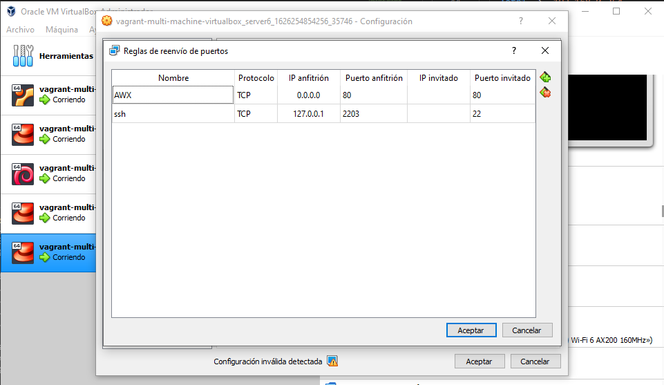

# primera-prueba-vagrant

## Comprobar si el equipo soporta virtualización, si resultado > 0, si la soporta, el resultado es el número de hilos:
```bash
grep -Eoc '(vmx|svm)' /proc/cpuinfo
```
## Instalación Vagrant
```bash
sudo apt install vagrant vagrant-libvirt
```

## Instalación KVM
1. Instalar dependencias y KVM:
```bash
sudo apt install qemu-kvm libvirt-daemon-system libvirt-clients bridge-utils virtinst virt-manager
```

2. Comprobar si libvirtd se iniciará automáticamente:
```bash
sudo systemctl is-active libvirtd
```

3. Para crear y administrar las máquinas virtuales:
```bash
sudo usermod -aG libvirt $USER
sudo usermod -aG kvm $USER
```

4. Comprobar que se ha creado correctamente adaptador puente:
```console
radamuz@ubuntu:~/primera-prueba-vagrant$ brctl show
bridge name	bridge id		STP enabled	interfaces
virbr0		8000.5254009ff684	yes		virbr0-nic
```

5. Crear adaptador puente xenbr0:
```bash
sudo netplan generate

sudo netplan apply

ip a | grep xenbr0
```
> Fuente: <https://www.techrepublic.com/article/how-to-create-a-bridge-network-on-linux-with-netplan/>

## Evitar que se demore mucho el apagado, por culpa de /usr/lib/libvirt/libvirt-guests.sh
```bash
sudo sed -i 's/SHUTDOWN_TIMEOUT=300/SHUTDOWN_TIMEOUT=0/g' /usr/lib/libvirt/libvirt-guests.sh
```

## Reenvío de puertos en Virtualbox (redes NAT)


## Los shell scripts de UNIX tienes un fin de línea distinto a los de Windows
```bash
dos2unix multi-copy-ssh-public-key.sh
```
> Fuentes: 
> * <https://stackoverflow.com/questions/39527571/are-shell-scripts-sensitive-to-encoding-and-line-endings>
> * <https://stackoverflow.com/questions/68385236/i-run-a-sh-script-created-by-me-and-it-fails-because-it-finds-invalid-characters> 
